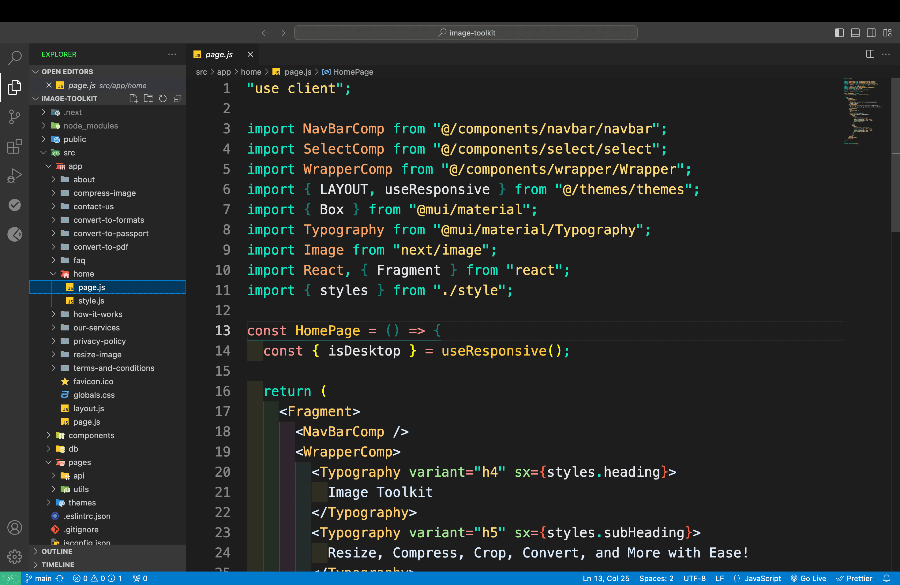

# Dim Dark Theme

Dim Dark is a sleek and modern dark theme for Visual Studio Code, designed to provide a visually soothing coding experience. Its balanced contrast and subtle color palette make it perfect for long coding sessions, reducing eye strain while keeping your workspace focused and distraction-free.

## Features

- **Relaxing Dark Palette**: A dimmed dark theme for a less intense look.
- **Improved Readability**: Carefully chosen colors for better code visibility.
- **Focus-Friendly**: Keeps your focus on what matters — your code.

## Installation

1. Open the Extensions view (`Ctrl+Shift+X` or `Cmd+Shift+X` on macOS).
2. Search for `Dim Dark Theme`.
3. Click **Install**.
4. Go to the **Theme Picker** (`Ctrl+K Ctrl+T` or `Cmd+K Cmd+T` on macOS) and select **Dim Dark**.

## Screenshot

Make sure you replace `path/to/your/screenshot.png` with the actual path or URL of your screenshot. This could be:

## Contributing

If you encounter any issues or have suggestions for improvements, feel free to open an issue or submit a pull request on [GitHub](https://github.com/professinalsidd/vs-code-theme-extension).

## Enjoy!

Elevate your coding experience with the **Dim Dark Theme**. 🌙
